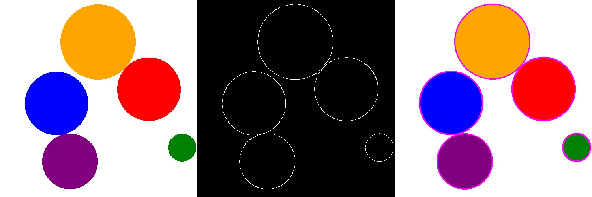

# Fast hough transform using GPU

## Dependencies
- OpenCV
- CUDA
- OpenMP

## Building
When in the project folder:
```
$ mkdir build && cd build
$ cmake build ..
$ cmake --build .
```

## Running
Currently, there are four programs:
- hough_gpu_streams: line detection using gpu and streams
- hough_gpu_managed: line detectino using managed cuda allocation
- hough_seq: line detection using cpu
- hough_circles_cpu: circles detection within radius range using cpu
- hough_circles_gpu: circles detection within radius range using gpu 

### Execution
#### Lines
```
./program_name filename threshold
```
where:
- `program_name`: name of a selected program.
- `filename`: an image file located in the `pictures` folder.
- `threshold`: value used while filling the accumulator (inclusive).

#### Circles
```
./program_name filename min_radius max_radius
```
where:
- `program_name`: name of a selected program.
- `filename`: an image file located in the `pictures` folder.
- `min_radius`: minimal radius (inclusive).
- `max_radius`: maximal radius (inclusive).

## Examples
### Circles

